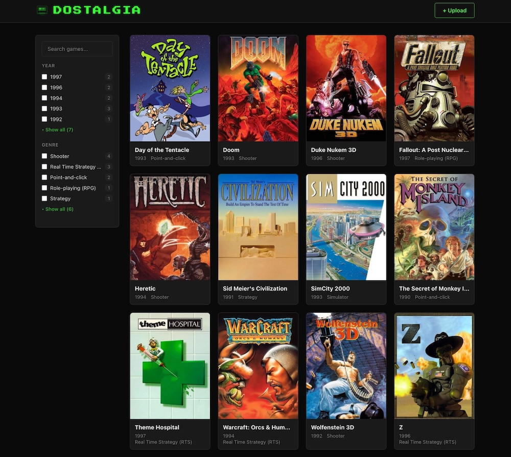
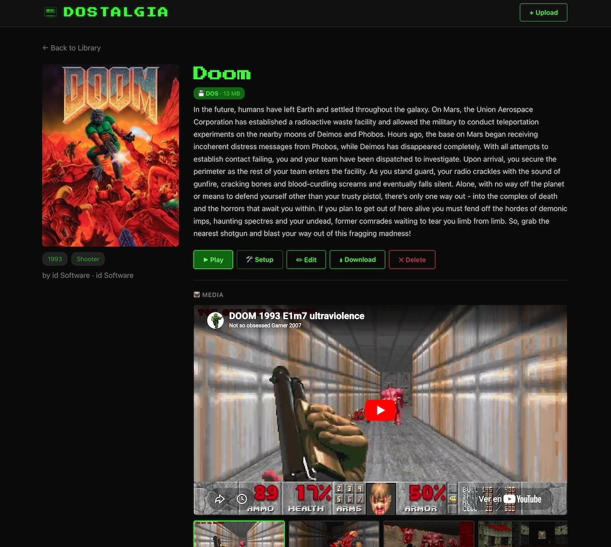

# DOStalgia 🕹️

A nostalgic DOS game hub. Upload your old DOS games, auto-scrape artwork and metadata from IGDB, and play them directly in your browser via js-dos (DOSBox compiled to WebAssembly).

### Library view


### Game detail view


## Features

### 🎮 Play in the browser
Every uploaded game is packaged into a `.jsdos` bundle — a standard ZIP with embedded DOSBox configuration. When you hit **Play**, js-dos v8 is loaded from CDN and starts the emulator instantly in your browser. No plugins, no native installs.

**Save states are automatic** — js-dos persists your game progress to the browser's storage. Come back anytime and pick up where you left off.

### 📦 Handles any file structure
DOS games come in all shapes. DOStalgia handles them transparently:

- **Flattening** — If your ZIP has a single root directory (e.g. `doom/` with all files inside), the extractor flattens it so the game files sit at the bundle root. No extra nesting.
- **Subdirectory games** — If files are deeper, the autoexec automatically `cd`s to the right directory before launching the executable.
- **CD images** — Games shipped on CD-ROM often need the disc mounted. DOStalgia detects `.iso`, `.cue`, `.img`, `.ccd`, and `.bin` files, fixes broken CloneCD `.cue` references (where the referenced `.bin` is actually `.img`), and mounts them in both `dosbox.conf` and `jsdos.json`.
- **CD-only games** — If the archive contains only CD images with no executable, a CD-only bundle is created that mounts the disc and drops you at the DOS prompt.
- **Hardcoded paths** — `ConfigPatcher` scans game config files for hardcoded absolute paths (e.g. `C:\FALLOUT1\MASTER.DAT`) that broke after flattening, and rewrites them to relative paths.

Other solutions such as [RomM](https://www.romm.app/) generate raw ZIP bundles and require you to write your own `dosbox.conf` with manual `mount` and `imgmount` commands. DOStalgia automates all of this for you.

### 🔍 Smart executable detection
On upload, DOStalgia scans every `.exe`, `.com`, and `.bat` file and picks the best candidate as the main executable using a scoring system:

1. **Not an installer** — INSTALL/SETUP/CONFIG executables are deprioritised
2. **DOS executables** — Pure DOS apps are preferred over Windows ones
3. **Larger files** — Bigger executables are more likely to be the game
4. **Shallow depth** — Files closer to the root are preferred
5. **Self-extractor filtering** — PKZIP/PKSFX stubs are filtered out

All discovered executables are stored and available in the **Edit** page, where you can pick a different one via radio buttons.

Again, RomM requires you to manually specify the executable in a custom `dosbox.conf`, while DOStalgia detects and configures it for you.

> **⚠️ Cache note:** If you change the executable, the `.jsdos` bundle is patched in-place. Your browser may serve a cached version of the old bundle — if the game doesn't launch with the new executable, **hard-refresh** the play page (Ctrl+Shift+R / Cmd+Shift+R).

### 🛠 One-click Setup launcher
Many DOS games include a `SETUP.EXE`, `INSTALL.EXE`, or `CONFIG.EXE` used to configure sound, controls, and graphics. When DOStalgia detects one:

- A **🛠 Setup** button appears on the game detail page
- Clicking it launches the setup executable *without modifying the main game bundle*
- The setup bundle is generated **on-the-fly** by the server — a modified `.jsdos` is streamed with the setup executable in the autoexec, then discarded. Nothing is written to disk.

This is not supported in RomM, where you would have to run the setup manually from the DOS prompt every time.

### 🪟 Windows game detection
DOSBox can't run Windows executables. DOStalgia's `PlatformDetector` reads MZ/PE/NE headers to detect Windows executables:

- The game detail page shows a **🪟 Requires Windows 3.1** badge
- The **Play** button is disabled with "Unplayable" text
- If you click Play anyway, a warning overlay explains the limitation with a **Try anyway** fallback
- Setup executables that are Windows-native are also filtered out from the Setup button

### 📡 IGDB metadata & media
DOStalgia integrates with [IGDB](https://www.igdb.com/) (via Twitch OAuth2) to auto-populate game info:

- **Auto Scrape** — On upload, DOStalgia searches IGDB by title and fills in year, genre, developer, publisher, description, and cover art. If IGDB finds a DOS result, it prioritises it.
- **Manual Search** — From the game detail page you can search IGDB by any query, browse results with cover thumbnails and DOS badges, and apply the one you want.
- **Media** — Videos (YouTube embeds) and screenshots (1080p) are fetched and displayed in a scrollable media gallery with a preview player.

**Setup:**

1. Go to https://dev.twitch.tv/console/apps → **Register Your Application**
2. Name: `dostalgia` (or anything), OAuth Redirect URL: `http://localhost`, Category: **Other**
3. Copy the **Client ID** and generate a **Client Secret**
4. Provide them via environment variables:

Method | How
--- | ---
Docker run | `-e TWITCH_CLIENT_ID=xxx -e TWITCH_CLIENT_SECRET=yyy`
Docker Compose | Copy `.env.example` to `.env` and fill in the values
Local dev | `export TWITCH_CLIENT_ID=xxx TWITCH_CLIENT_SECRET=yyy`

IGDB features degrade gracefully — if credentials aren't set, uploads and metadata editing still work, just without auto-scrape.

## Quick Start

### With Docker Compose (easiest)

```bash
# 1. (Optional) Enable IGDB metadata auto-scrape
cp .env.example .env
# Edit .env with your Twitch credentials (see IGDB section below)

# 2. Pull & run
docker compose up -d
```

Open http://localhost:8765

### With Docker

```bash
docker run -p 8765:8765 -v $(pwd)/data:/data \
  -e TWITCH_CLIENT_ID=your_id \
  -e TWITCH_CLIENT_SECRET=your_secret \
  droideparanoico/dostalgia
```

## Development (without Docker)

Terminal 1 — Frontend dev server:
```bash
cd frontend && npm install && npm run dev
```

Terminal 2 — Quarkus dev server:
```bash
mvn quarkus:dev
```

Open http://localhost:5173 (Vite proxies API calls to Quarkus on port 8765)

### Production build (local)
```bash
cd frontend && npm install && npm run build
mvn package -DskipTests
java -jar target/quarkus-app/quarkus-run.jar
```

## Architecture

- **Backend**: Quarkus (Java 21, JAX-RS) — REST endpoints, zero external database
- **Frontend**: Svelte 5 SPA with hash-based routing
- **Emulation**: js-dos v8 loaded from CDN, runs DOSBox in WebAssembly
- **Storage**: JSON-per-game under `/data/games/{id}/game.json`
- **Saves**: Browser localStorage / indexedDB (managed by js-dos)